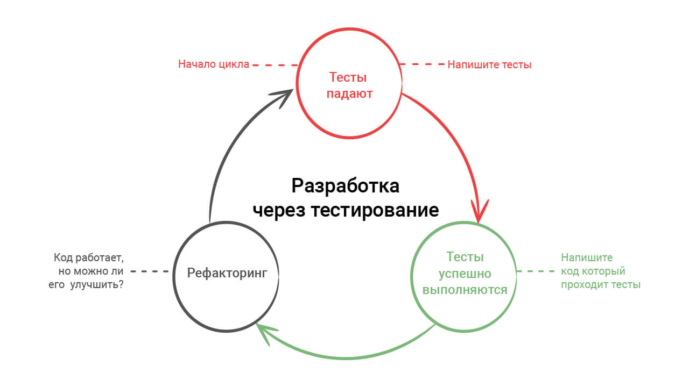
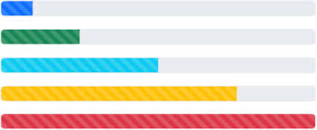
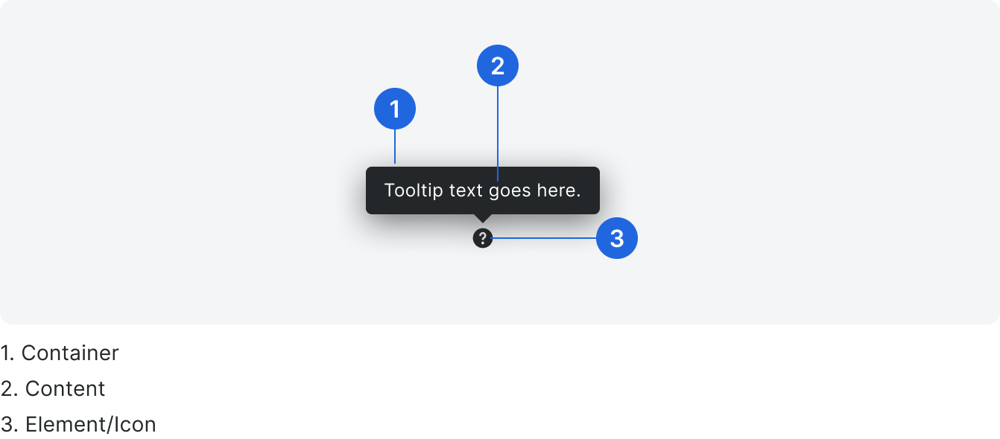
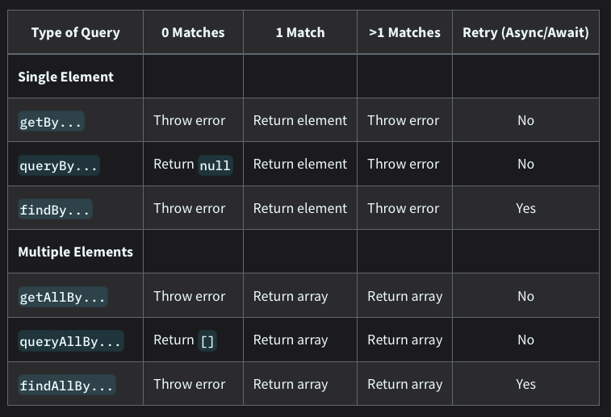

# TDD - Test Driven Development

Подход к разработке, который заключается в последовательном написании теста, который будет преднамеренно провален, после чего пишется код, который удовлетворит тест. 

Следующий этап – добавление нового функционала для тестирования или усложнение существующего. Тест проваливается. После чего пишется, код, который удовлетворит уже новый тест.

Процесс разработки с использованием этого подхода можно описать как цикл: тестирование – провал – написание рабочего кода – усложнение теста. 



# Что тестируется

- вёрстка - например: кнопки, инпаты, фрагменты, страницы
- функционал - например: вызов модального окна, переход на роут
- бизнес-логика - например: переход по пользовательскому маршруту (CJM) с соблюдением условий (conditions)

# Основные виды тестов

## Unit

- тестирование изолированных модулей, например: `ui`, `hook`
- это тестирование фундаментальных частей системы

## Integration

- тестирования группы модулей, например: `fragments`, `pages`
- это тестирование позволяет выявить и предотвратить возможные конфликты при использовании нескольких модулей

## e2e - End To End

- тестирование процесса или сценария использования приложения, рассмотрим на примере страницы регистрации:
  - переход на страницу
  - ввод логина
  - получение реакции (валидация)
  - ввод пароля
  - получение реакции (валидация)
  - нажатие на кнопку регистрации
  - получение реакции (сообщение)
- если первый тест пройден - проверяется следующий этап, например следующий этап регистрации - верификация

# Как запускать тесты

[Можно указывать название тестируемого файла, или `--watch`](https://github.com/atls/tools#тестирование)

# Подготовка к написанию тестов (Unit, Integration)

## Необходимые пакеты

### Глобально:

- `@atls/config-jest` - наш конфиг `jest`

### Каждый пакет, локально:

- `@testing-library/react` - библиотека для тестирования приложений на `React`
- `@emotion/jest` - библиотека для тестирования UI написанного с помощью `emotion`

## Необходимые настройки

### next.config.js

```js
module.exports = {
  compiler: {
    reactRemoveProperties: true
  }
}
```

Благодаря этому в дев и билд не попадут аттрибуты `data-testid`, которые нам могут понадобиться для тестов сложных компонентов/фрагментов.

## Как пишем тесты

### Пример `Unit`-теста: компонент прогрессбара



```tsx
import React               from 'react'
import { FC }              from 'react'
import { memo }            from 'react'
import { useMemo }         from 'react'

import { Box }             from '@ui/layout'

import { ProgressElement } from './progress.element'
import { ProgressProps }   from './progress.interfaces'

export const Progress: FC<ProgressProps> = memo(({ percent, color = 'pink' }) => {
  const currentPercent = useMemo(() => {
    if (percent < 0) return 0
    if (percent > 100) return 100

    return percent
  }, [percent])

  return (
    <Box
      position='relative'
      width='100%'
      height={3}
      borderRadius='f2'
      backgroundColor='gray'
      flexShrink={0}
    >
      <ProgressElement
        position='absolute'
        top={0}
        left={0}
        height={3}
        width={`${currentPercent}%`}
        backgroundColor={color}
        borderRadius='f2'
      />
    </Box>
  )
})
```

#### План тестирования

1. Вёрстка - убедиться что контейнер с потомками успешно отрендерился
2. Функционал - при передаче значения `percent` в пропсах - отображает нужный нам прогресс

#### Тестирование

```tsx
// Здесь мы обозначаем среду для `jest`, в которой будет выполняться тест.
// Для фронтенда это всегда будет `jsdom`
/**
 * @jest-environment jsdom
 */

import { RenderResult }  from '@testing-library/react'
// Расширение для правил тестирования, чтобы можно было задействовать `toHaveStyleRule`
import { matchers }      from '@emotion/jest' 
import { render }        from '@testing-library/react'

import React             from 'react'

// Берем провайдер темы и объект темы с локального пакета - для правильной работы `styled-components`
// необходимо обязательно рендерить тему
import { ThemeProvider } from '@ui/theme'
import { theme }         from '@ui/theme'

// Сам тестируемый компонент
import { Progress }      from './progress.component'

// Расширяем мэтчеры тестирования с помощью `@emotion/jest`
expect.extend(matchers)

type CustomRender = (element: React.ReactNode | React.ReactNode[]) => RenderResult

// Создаем кастомный рендер - чтобы не повторятся в наших тестах с рендером темы
const customRender: CustomRender = (element) => render(<ThemeProvider>{element}</ThemeProvider>)

// С `describe` начинается группа тестирования. С его помощью обозначаются группы тестов, 
// которые можно логически объединить в одну область тестирования. Можно обходиться и без этого,
// но тогда тесты будут разрозненны и тяжело читаемы в результате тестов.
describe('Progress component', () => {

  // Это уже наш тест. Описываем что тестируем и передаем фукнцию с тестом.
  // К `it` можно добавлять "модификаторы". Напр.:
  // - `it.only` - из всех тестов в файле будет выполнятся только этот
  // - `it.skip` - этот тест будет пропускаться
  it('renders correct percent width', () => {
    const testPercent = 50
    
    // Рендерим наш компонент.
    const { container } = customRender(<Progress percent={testPercent} />)

    // Т.к. наш компонент не имеет каких либо кнопок, инпутов или текста, то 
    // поиск его в дереве происходит стандартным `querySelector`.
    const progressBar = container.querySelector('div > div > div')

    // Проверка что такой элемент в дереве нашелся
    expect(progressBar).toBeTruthy()

    // Проверка что у элемента есть правило ширины и оно соответствует значению выше.
    expect(progressBar).toHaveStyleRule('width', `${testPercent}%`)
  })

  it('applies the correct color', () => {
    const testColor = 'pink'
    const { container } = customRender(<Progress percent={50} color={testColor} />)

    const progressBar = container.querySelector('div > div > div')

    // Проверяем что наш компонент при заданных пропсах имеет в стилях значение из темы.
    expect(progressBar).toHaveStyleRule('background-color', theme.colors[testColor])
  })
})
```

### Пример `integration`-теста: компонент тултип

Компонент рендерится при клике по элементу, к которому прикреплен:



#### План тестирования

1. Верстка
2. Функционал - рендер по триггеру (клик, ховер)

```tsx
/**
 * @jest-environment jsdom
 */

import { RenderResult }  from '@testing-library/react'
import { fireEvent }     from '@testing-library/react'
import { act }           from '@testing-library/react'
import { render }        from '@testing-library/react'

import React             from 'react'

import { ThemeProvider } from '@ui/theme'

import { Tooltip }       from './tooltip.component'

type CustomRender = (element: React.ReactNode | React.ReactNode[]) => RenderResult

// Наш тултип зависит от размеров экрана, т.е. работает с `ResizeObserver`.
// Мы рендерим наши компоненты с помощью `jest`, а значит не в браузере.
// Поэтому приходится "мокать" этот функционал браузера.
// "Мокать" == заменять что-то реальное "фейком"
global.ResizeObserver = jest.fn().mockImplementation(() => ({
  observe: jest.fn(),
  unobserve: jest.fn(),
  disconnect: jest.fn(),
}))

const customRender: CustomRender = (element) => render(<ThemeProvider>{element}</ThemeProvider>)

describe('Tooltip component', () => {
  it('renders with text', async () => {
    const { findByText, getByText } = customRender(
      <Tooltip trigger='hover' container={<span>Tooltip text</span>}>
        <span>Click me</span>
      </Tooltip>
    )

    const triggerSpan = getByText('Click me')

    expect(triggerSpan).toBeTruthy()

    // Здесь мы запускаем эвент по клику на элемент с текстом.
    // Таким образом триггерим рендер тултипа.
    act(() => fireEvent.click(triggerSpan))

    const tooltipText = await findByText('Tooltip text')

    expect(tooltipText).toBeTruthy()
  })
})
```

## Как искать нужные компоненты при рендере в `jest`

Мы должны писать тесты так, будто на страницу пришёл пользователь и проводит действия. Когда мы оказываемся на любой странице, за что наш глаз цепляется? Это текст, кнопки, инпуты, формы... Все что "осязаемо" для глаза.

Вот как тестировать форму с точки зрения пользователя:
- попал на страницу
- увидел форму
- увидел инпут
- заполнил инпут
- увидел еще инпут
- заполнил инпут
- ...
- увидел кнопку для сабмита
- нажал кнопку

Для симуляции поведения пользователя рекомендуется искать элементы так ([оригинал](https://testing-library.com/docs/queries/about/#priority)). Нумерация в порядке приоритета:

1. Запросы, доступные для всех: Запросы, которые отражают опыт использования визуальными/мышевыми пользователями, а также теми, кто использует вспомогательные технологии.
- `getByRole`: Этот метод можно использовать для запроса любого элемента, который представлен в дереве доступности. С опцией `name` вы можете фильтровать возвращаемые элементы по их доступному имени. Это должно быть вашим главным приоритетом почти во всём. Нет многого, что вы не можете получить с его помощью (если не можете, возможно, ваш UI недоступен). Чаще всего это будет использоваться с опцией `name` следующим образом: `getByRole('button', {name: /submit/i})`. Проверьте список ролей.
- `getByLabelText`: Этот метод действительно хорош для полей форм. Перемещаясь по форме веб-сайта, пользователи находят элементы, используя текст метки. Этот метод эмулирует это поведение, поэтому он должен быть вашим главным приоритетом.
- `getByPlaceholderText`: Заполнитель не является заменой метки. Но если это всё, что у вас есть, то это лучше, чем альтернативы.
- `getByText`: Вне форм текстовое содержимое является основным способом, с помощью которого пользователи находят элементы. Этот метод можно использовать для поиска неинтерактивных элементов (таких как `div`, `span` и параграфы).
- `getByDisplayValue`: Текущее значение элемента формы может быть полезно при навигации по странице с заполненными значениями.
2. Семантические запросы: Селекторы, соответствующие HTML5 и ARIA. Обратите внимание, что пользовательский опыт взаимодействия с этими атрибутами сильно различается в разных браузерах и вспомогательных технологиях.
- `getByAltText`: Если ваш элемент поддерживает альтернативный текст (`img`, `area`, `input` и любой пользовательский элемент), то вы можете использовать это для поиска такого элемента.
- `getByTitle`: Атрибут `title` не последовательно читается скринридерами и не виден по умолчанию для пользователей с видением.
3. Тестовые идентификаторы
- `getByTestId`: Пользователь не может видеть (или слышать) эти, поэтому это рекомендуется только в случаях, когда вы не можете сопоставить по роли или тексту, или это не имеет смысла (например, текст динамичен).

<details>

<summary>Шпаргалка запросов</summary>



</details>

### Поиск по тексту

Многие методы дают доступ к поиску по тексту (текст, плейсхолдер, вэлью в инпутах...) либо уточняющий поиск (`...ByRole(..., { name: '...' })`). В этих методах <mark>нельзя искать по локали/переводу</mark>. Допустимые методы поиска:
- `aria-label`: [лучшие практики](https://www.aditus.io/aria/aria-label/)
- `testid`: см. далее

## Отдельно про `data-testid`

Этим пользуемся в самом крайнем случае. Правила по его неймингу:

`...data-testid='component-subcomponent-subsubcomponent-...-id'`

Например, для свитча, который:
- имеет в детях нужный нам `<span>...</span>`
- которого может быть много на одном фрагменте/странице и нужно обратиться к конкретному

```tsx
<Switch testId={1} />
```

```tsx
<span data-testid='switch-span-{props.testId}'>...</span>
```

Если необходимо добавить уникальный `testid` через пропсы, то добавляем в конец как ID.

## Примеры тестов

https://gist.github.com/Nelfimov/ba3768ecf31f804b7f9378807be4c2fa - `data-testid`
https://gist.github.com/Nelfimov/ade5263ea89d82a240368fe7aa8c09ba - хук
https://gist.github.com/Nelfimov/aa79af1bb2cff9af4e20963f4ccb7cea - фрагмент с клик эвентами
https://gist.github.com/Nelfimov/b7700fa608ca696dc6c9f708e624b1dd - компонент с копированием в `clipboard` по клику

# E2E (End-to-end)

будет дополняться
