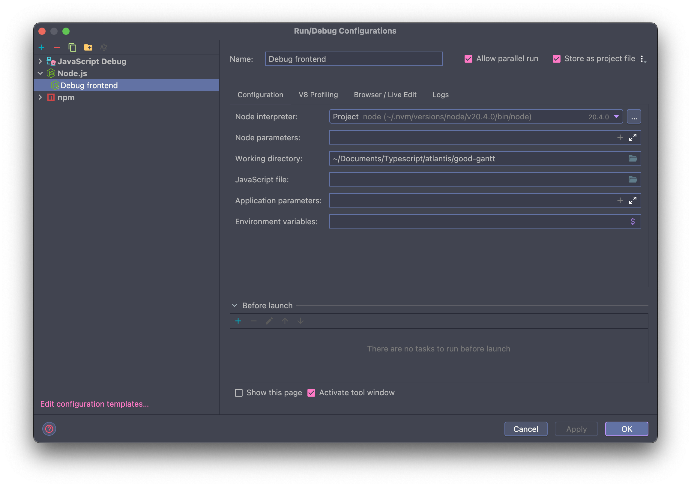
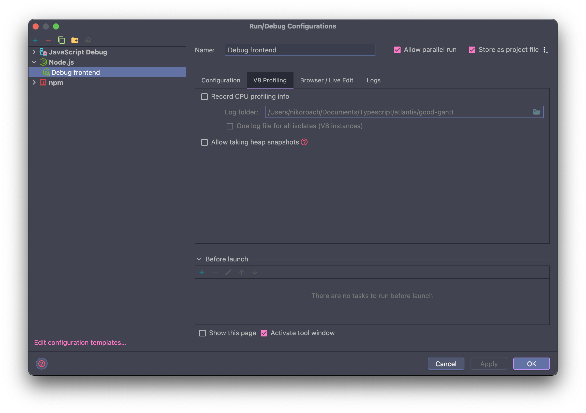
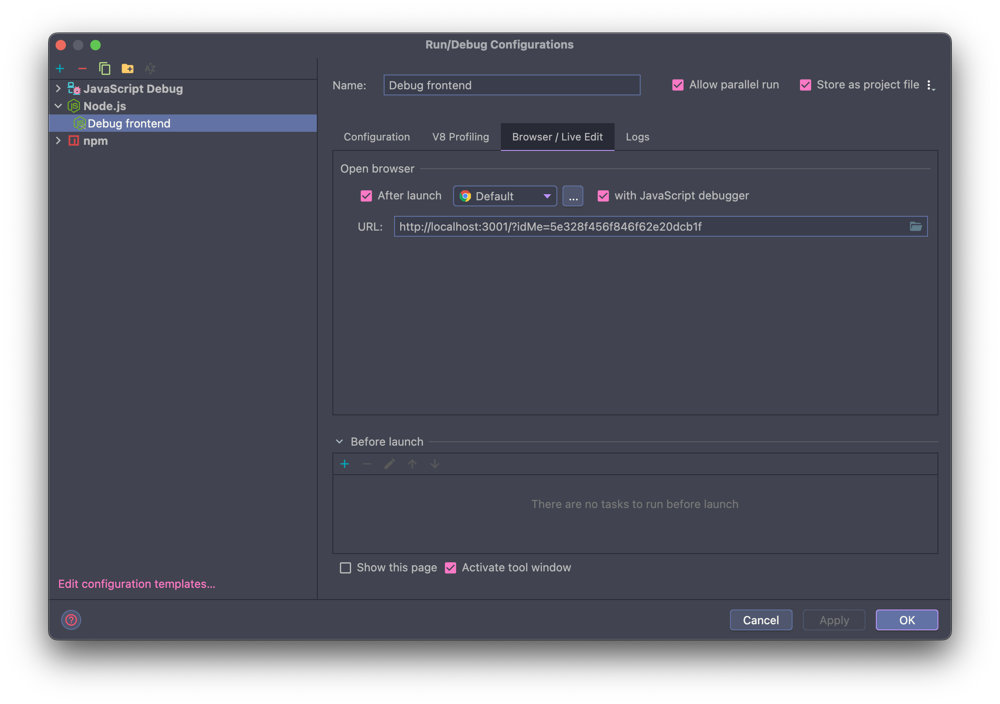
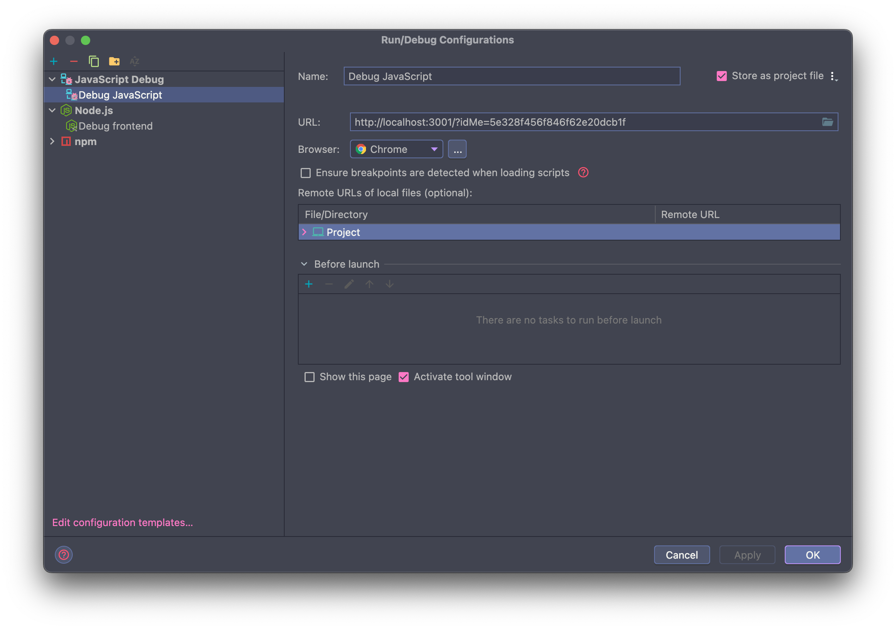
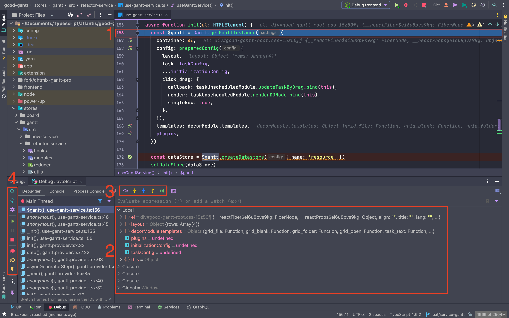

# Дебаг

Основная цель отладки: получить больше информации об ошибке. Это необходимо для того, чтобы правильно поставить вопрос, если существует баг или проблема которые нужно решить.

## Алгоритм отладки

Алгоритм простой и понятный. Ключевое здесь: если есть трудности — обращаться за помощью.

### 1. Если в логах есть ошибка

Гуглим ошибку. Нашли решение? Если да, то внедряем к себе и идём дальше. Если нет, то начинаем дебажить.

### 2. Локализация проблемы

Необходимо найти место, провоцирующее ошибку.

1. Это можно сделать с помощью трейса: при появлении ошибки в консоли будет цепочка вызовов, по которой можно найти строчку / файл, провоцирующий ошибку.

2. **Если не получилось локализовать проблему в течение 30 мин:** обращаемся за помощью. Обращаться за помощью нужно предоставив все логи и в подробностях описав свои действия, предшествовавших ошибке.

3. **Далее.** После локализации проблемы:
- (рекомендовано) ставим брейкпоинты и переходим в дебаг. Работа с дебагом описана ниже.
- Либо ставим `console.log` на каждой строчке. Первое что нужно выяснить – какая строка провоцирует ошибку, если она еще неизвестна.

4. Когда видим проблемную строку – смотрим еще раз на лог об ошибке. В 90% случаев там будет сказано, в чем проблема.

5. **Если нет лога об ошибке или не понимаем что там написано или течение 30 мин не можем разобраться с проблемой: обращаемся за помощью.**

В обращении за помощью необходимо приложить:

- Проблемную строку, лог об ошибке (если есть),
- Закоммитить код где можно воспроизвести проблему
- Приложить гайд, как это сделать (что запустить, куда смотреть)

## Дебаг в IDE от JetBrains (WebStorm, IntelliJ...)

### Если работаем со стандартным сервером `NextJS` или `CRA`:

0. Расставляем брейкпоинты
1. Запускаем через IDE проект (macOS: ^ + R)
2. Зажав Cmd + Shift / Ctrl + Shift в консоли кликаем по URL запущенного сервера
3. Открывается стандартный браузер (желательно Chrome)
4. Дебажим

### Если работаем с кастомным сервером, напр. `NextJS` + `ExpressJS`:

0. Создаем конфигурации запуска для дебага. Конечно же вставляя свои названия и URL для запуска:

NodeJS debug

Javascript debug

1. Запускаем наш проект в `dev`
2. Запускаем конфиг `NodeJS debug`
3. Чтобы другим участникам проекта не надо было создавать свои конфиги, можно их сохранить в проекте, нажав вверху на галочку "Store as project file"

[Первоисточник](https://www.jetbrains.com/help/webstorm/debugging-javascript-in-chrome.html#debugging_js_on_local_host_development_mode)

### Интерфейс работы с дебаггером

Интерфейс

1. Текущая отрабатываемая строка
2. Значения переменных на текущем этапе. Обрати внимание, что идет разделение по областям видимости.
3. Пошаговое выполнение кода:
- Step over - выполнить текущую строку, не проваливаясь в нее
- Step into - выполнить текущую строку, проваливаясь в нее для детального анализа работы кода. Например когда конкретно данная строка не работает как ожидается
- Force step into - то же что и выше, но уникальные случаи когда step into пропускает их, не будут пропущены
- Step out - обратная операция step into. Возврат на уровень выше к исполнителю.
- Run to cursor - исполняет код до вашего курсора в редакторе
4. Общая работа с дебаггером:
- Перезапустить процесс дебаггера
- Перезагрузить страницу браузера
- Настройка процесса
- Продолжить исполнение программы. Остановится на следующем брейкпоинте, если есть
- Остановить программу
- Показать брейкпоинты
- Замьютить брейкпоинты. Если не нужно чтобы программа останавливалась на них
- Включить остановку программы при ошибках/exception

[Первоисточник](https://www.jetbrains.com/help/idea/stepping-through-the-program.html#step-into)

## Советы

Может сюда стоит добавить некоторые советы и внешние ссылки? 
