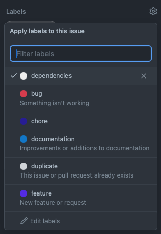

# `Labels`

### Для чего нужны лейблы?

Для управления приоритетами или типами задач, так как на данный момент в GitHub нет никаких других возможностей, кроме как создания лейблов.

#### Например

- Issue с лейблом *documentation* — задача по документированию
- Issue с лейблом *feature* — задача является фичей

По этой причине, все issue должны иметь свои лейблы. Как минимум, потом по ним же можно проводить сортировку, чтобы быстрее ориентироваться.

 

[Документация по Labels на GitHub Docs](https://docs.github.com/en/issues/using-labels-and-milestones-to-track-work/managing-labels)
