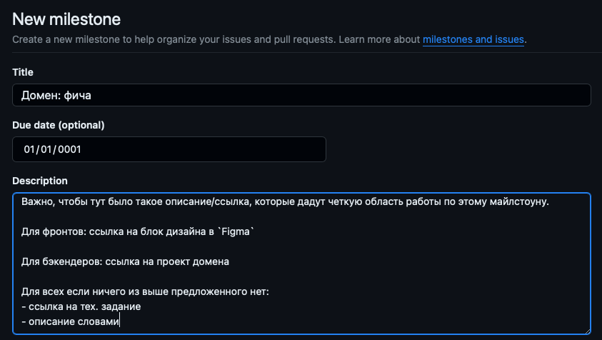

# `Milestones`

Майлстоун - это цель, этап в текущей работе, который объединяет в себе `issues` и `pull request`. С его помощью мы можем:
- разбить проект на куски, по доменам или фичам (логическим блокам)
- каждому куску назначить таски и сроки

Майлстоун позволит контролировать прогресс выполнения задач, а так же сопоставлять текущую ситуацию с планом по срокам.

#### Пример заполнения

[Документация по Milestones на GitHub Docs](https://docs.github.com/ru/issues/using-labels-and-milestones-to-track-work/about-milestones)
