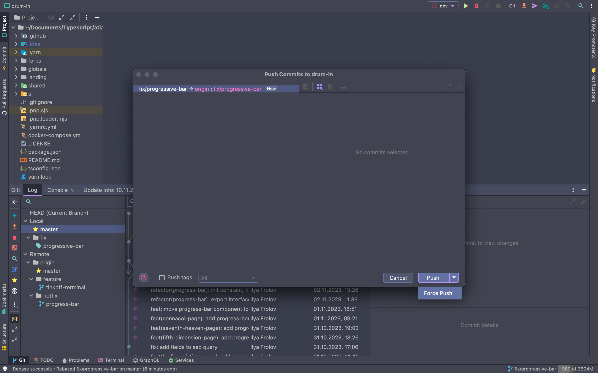

# Работа с `Rebase`

Все ветки `git` имеют начало - ветка может стартовать от какого-то коммита `master`, а может из коммита любой другой ветки. В любом случае есть стартовый "базовый" коммит.

Что делать, если вы стартовали/базировались с одного коммита, а пока работали, ветка, с которой вы "базировались", ушла дальше - появились в ней новые коммиты, напр. другие ПР были вмержены? Есть два пути:
- мерж
- ребейз

### Разница между rebase и merge

Из сравнения видно, что `merge` создает дополнительный коммит мержа, а так же делает картину метро в истории коммитов. Поэтому предпочтение отдается `rebase` - лишних коммитов нет, история коммитов линейная и красивая.

Ребейз, как следует из названия - это операция по изменению базиса вашей ветки. Т.е. изменить коммит, с которого вашего ветка стартовала. Нагляднее всего будет измученная картинка:

Т.к. обычно операция `merge` не вызывает сложностей, остановимся на `rebase`.

Его можно делать если:
- вы работаете один на ветке либо заранее договорились со всеми коллегами по ветке что будете это делать. Ведь эта операция перепишет историю коммитов для всех!
- до чьего либо ревью

В остальных случаях - только мерж.

### Как делать rebase?

1. В IDE `Cmd + 9` (`Ctrl + 9`) для открытия панели git:

2. Обновляем ветку от которой хотим провести ребейз. Например, ваша ветка базируется на мастере, значит нужно обновить локально мастер:

3. Начинаем ребейз. Находясь на вашей рабочей ветке, кликаем по той ветке по которой хотим "перебазироваться":

4. Далее начинается операция по ребейзу - git проходится по истории коммитов вашей ветки и ветки от которой вы хотите перебазироваться и сравнивает есть ли конфликты. Если есть - высвечивает предлагая выбор что вы хотите внести в вашу ветку - изменения вашей ветки или изменения ветки с которой вы перебазируетесь. ВНИМАНИЕ: `yarn.lock`, `pnp.cjs`, `pnp.loader.mjs` можете выбирать любое ЦЕЛИКОМ на ваш "вкус" - хоть с вашей ветки хоть с другой. Эти файлы генерируются командой `yarn` в корней проекта, поэтому даже если накосячите, всегда можно перегенерировать.

5. После окончания ребейза вам высветиться такое:

6. На этом этапе важно понимать - вы сделали ребейз только локально. Ваша локальная ветка перебазировалась. Однако ремоут, ваша ветка на сервере, все еще прежняя. Необходимо обновить и ее. Если вы попробуете просто `git push` (или для продвинутых `Cmd + Shift + K` (`Ctrl + Shift + K`)) то вам высветится ошибка - необходимо принять ремоут изменения прежде чем пушить локал. Соответственно теперь наша цель - совместить/"переписать" изменения локальные на ремоут. Это можно сделать следующим образом:

- `git push --force-with-lease` или его эквивалент в IDE `Cmd + Shift + K` (`Ctrl + Shift + K`):

# ВНИМАНИЕ
Сделав это вы перетрете все хэши коммитов. Если вы это сделаете после чьего-либо ревью - их комментарии перетрутся и история замечаний потеряется. Поэтому повторим - ребейз делаем только до чьего либо ревью.
